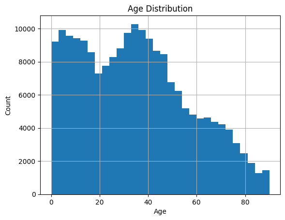
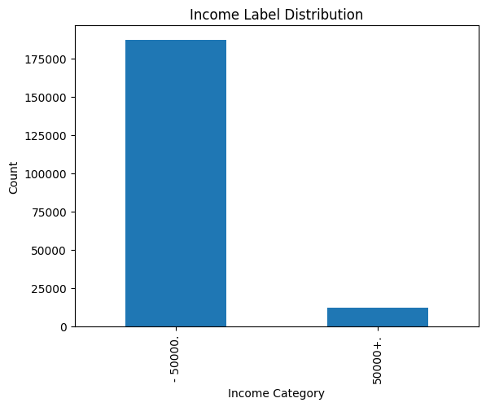
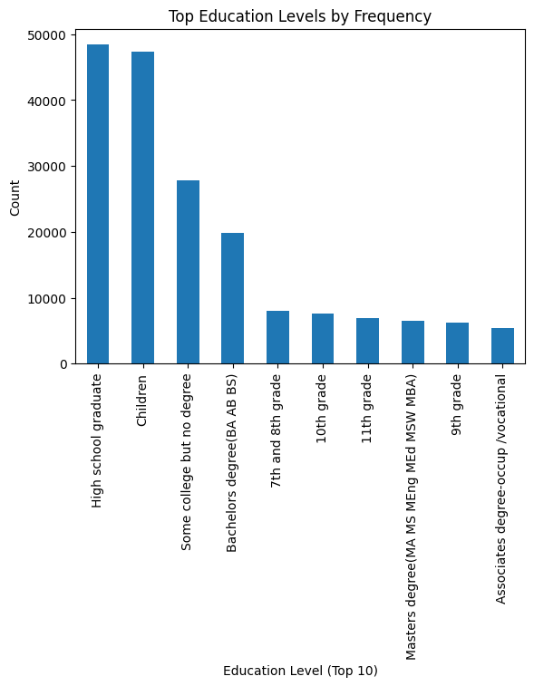
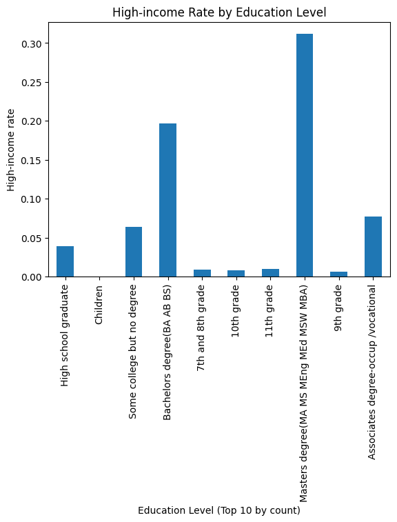

# 1. Introduction

This project develops two core machine-learning models:
(1) A supervised income classifier predicting whether an individual earns >$50,000 using 40+ demographic and employment features.
(2) A customer segmentation model that clusters individuals into well-defined groups that are demographically and economically meaningful.

# 2. Dataset Structure & Assumptions
## 2.1 Dataset Shape
- 199,523 rows (each row = one CPS respondent)
- 42 columns total: 41 features, 1 label (“- 50000.” or “50000+.”), Weight column representing population counts

## 2.2 Data Source
The data resembles 1994–1995 Current Population Survey microdata. It contains:
Type	   Count	  Examples
Numeric	    13	     age, capital gains, wage per hour, employer count
Categorical	28	     education, marital status, sex, race, occupation code
Weight	     1	     “weight”
Label	     1	     income category

## 2.3 Survey Weights
Weights play a critical role:
- Must be applied in cluster size estimation
- Must be applied in income rate per cluster
- Must be applied to classifier fit as sample weights

# 3. Exploratory Data Analysis
EDA is executed in 'EDA.py', which generates figures such as: 
- Age distribution
- Income label distribution
- Education frequency
- High-income rate by education

## 3.1 Key EDA Findings

(1) Age Distribution

- Broad distribution from 0 to 90+.
- A significant child and youth population is present.
- Working-age peak at ~30–45.

(2) Income Distribution

- Severely imbalanced:
- Majority are ≤$50k
- Small minority (≲10%) earn >$50k
- This affects classifier recall and requires careful threshold tuning.

(3) Education Distribution

Top categories:
- High school graduate
- Children
- Some college
- Bachelor's degree

(4) Income vs Education

- Strong monotonic trend:
- Higher education → higher high-income probability
- Master's degrees have >30% high-income rate
- Lower schooling levels (7th–10th grade) produce near-zero high-income rate
- Education is the single strongest predictor and dominates both segmentation and classification.

# 4. Data Preprocessing & Feature Engineering
## 4.1 Numeric Features
Use median imputation and standard scaling to ensure stable optimization and prevents capital gains/losses variables from dominating clustering and boosting splits. 

## 4.2 Categorical Features
- Impute missing categories as explicit “missing” token
- One-hot encoding

# 5. Segmentation Model
## 5.1 Mathematical Formulation
Weighted K-Means Objective
    Minimize   sum_i [ w_i * || x_i - μ_{z_i} ||^2 ]

Assignment:
    z_i = argmin_j  || x_i - μ_j ||^2

Centroid update (weighted mean):
    μ_j = ( sum_{i in cluster j} w_i * x_i ) / ( sum_{i in cluster j} w_i )

Interpretation:
    - w_i increases the influence of individual i.
    - Centroids become population-representative.
    - Cluster boundaries reflect weighted distances.

## 5.2 Cluster results
| Cluster | Pop-weight (millions) | High-income rate | Interpretation                                                    |
| ------- | --------------------- | ---------------- | ----------------------------------------------------------------- |
| 0       | 75.1M                 | 13.0%            | Mid-aged, mixed education, moderate income                        |
| 1       | 80.5M                 | 1.7%             | Older, lower-income, many widowed                                 |
| 2       | 74.8M                 | 11.7%            | Mid-aged, similar to cluster 0 but slightly different composition |
| 3       | 88.1M                 | 0%               | **Children / youth**                                              |
| 4       | 28.7M                 | 8.2%             | Early-career adults                                               |

Noting that we assign k = 5 because high-income rates vary sharply:
| Cluster | High-income rate |
| ------- | ---------------: |
| 0       |            0.130 |
| 1       |            0.017 |
| 2       |            0.117 |
| 3       |            0.000 |
| 4       |            0.082 |

Cluster 3 (Children / youth)
- Avg age ≈ 7.8
- Education = “Children”
- Never married
- High-income rate ≈ 0
- Largest weighted population (~88M)

Cluster 1 (Older, low-income adults)
- Avg age ≈ 55.5
- High school or some college dominant
- Strong widowed share
- High-income rate ~1.7%

Clusters 0 & 2 (Working-age mainstream)
- Avg age ≈ 39
- Mix HS / some college / BA
- Married-civilian dominant
- High-income rates ~11–13%

Cluster 4 (Early-career adults)
- Avg age ≈ 33.5
- Moderate BA share, fewer elderly
- High-income rate ~8%

## 5.3 FIndings
- Cluster 3 (Children) is the largest population segment.
- Clusters 0 & 2 capture most prospective high-income earners.
- Highly interpretable patterns emerge from marital status + education.

# 6. Supervised Model: Income classifier
Implemented in 'train_classifier.py'
We choose gradient boosting because:
- Boosting models are state-of-the-art for census-style tabular data with nonlinear interactions.
- Can capture high-order feature interactions
- Robust to sparse one-hot features

## 6.1 Pipeline
Preprocessor (ColumnTransformer)
      → OneHotEncoder (categorical)
      → StandardScaler (numeric)
      → GradientBoostingClassifier

## 6.2 Model Rationale
Gradient Boosting was chosen because:
- models nonlinear interactions
- handles sparse one-hot features well
- supports sample weighting
- produces calibrated probability estimates
- performs well on tabular census-like data

## 6.3 Objective Function
Weighted Loss Objective
-----------------------

Minimize:     sum_i [ w_i * ℓ(y_i, f(x_i)) ]

Where:
    - w_i is the survey weight for individual i
    - y_i is the true income label (0 or 1)
    - f(x_i) is the model's predicted probability for class 1
    - ℓ(·) is the logistic loss function

Interpretation:
    - Individuals with larger w_i have a greater influence on the model.
    - The classifier learns a function that reflects the weighted population,
      not the raw sample distribution.

## 6.4 Training Procedure
- Stratified 80/20 split, where 159618 for training and 39905 for testing 
- Passing sample weights into .fit()
- Predicting both class labels and probabilities
- Evaluating on test set with Accuracy, ROC-AUC, classification report, confusion matrix

# 7. Evaluation
## 7.1 Classification Metrics
| Metric    | High-income (1) | Low-income (0) |
| --------- | --------------- | -------------- |
| Precision | 0.754           | 0.962          |
| Recall    | **0.414**       | 0.991          |
| F1        | 0.535           | 0.977          |

- Accuracy: 0.9553
- ROC-AUC: 0.9490
- Confusion Matrix:
[[37095   334]
 [1451   1025]]

## 7.2 Interpretation
- Model is very strong globally (AUC ≈ 0.95)
- High-income group is difficult due to rarity
- Precision for the high-income group is excellent (0.75)
- Recall can be improved depending on business threshold decisions

## 7.3 Error Analysis
False negatives (high-income predicted as low-income) are large in count because the dataset is severely imbalanced.

# 8. Alternatives for classifier
Models that were possible but inferior for this dataset
| Model                   | Strength                 | Why not chosen                                                              |
| ----------------------- | ------------------------ | --------------------------------------------------------------------------- |
| **Logistic Regression** | Interpretable            | Poor with nonlinear interactions; weak on high-cardinality categorical data |
| **Random Forest**       | Good baseline            | Weaker probability calibration; less sensitive to subtle interactions       |
| **SVM**                 | Strong margin classifier | Cannot handle 200+ one-hot features efficiently; poor scalability           |
| **Neural Networks**     | Flexible                 | Requires careful tuning; worse on tabular data without embedding layers     |
| **kNN**                 | Simple                   | Impossible with 200k rows + sparse features                                 |

# 9. Business Implications & Deployment Strategy
## 9.1 How to Use the Classifier
- If the goal is high precision (e.g., costly premium campaign) → increase threshold
- If the goal is high recall (collect all possible high-potential leads) → lower threshold
- Use ROC or PR curves to select threshold based on marketing ROI

## 9.2 How to Use the Segmentation
- Cluster 3 → Family campaigns
- Cluster 1 → Senior-targeted value campaigns
- Clusters 0 & 2 → Digital & financial product targeting
- Cluster 4 → Early-career lifestyle products

## 9.3 Integration Path
- Generate probabilities using trained model
- Assign clusters using KMeans pipeline
- Combine both for compound targeting strategies:
- Example: “High-income probability >0.6 AND Cluster ∈ {0,2}”